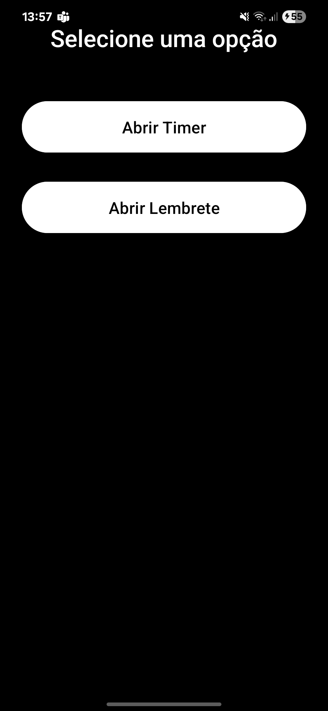
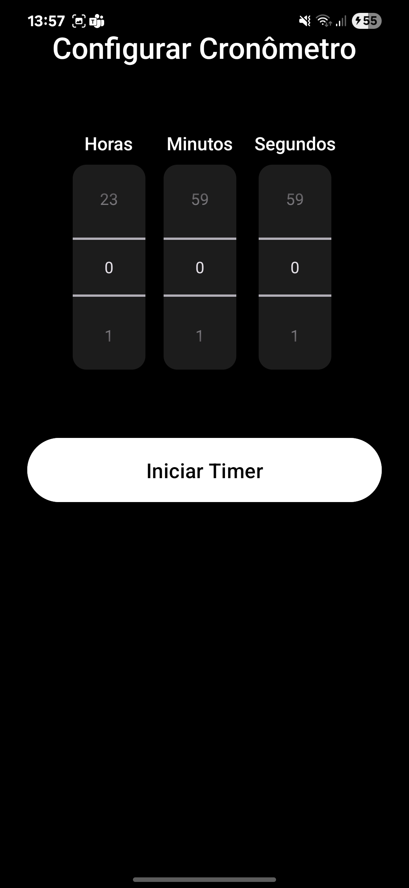
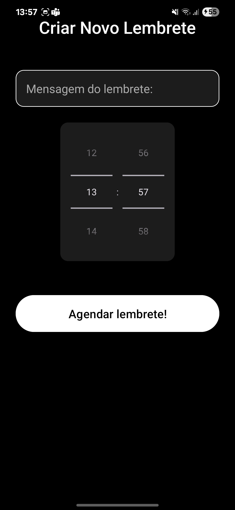
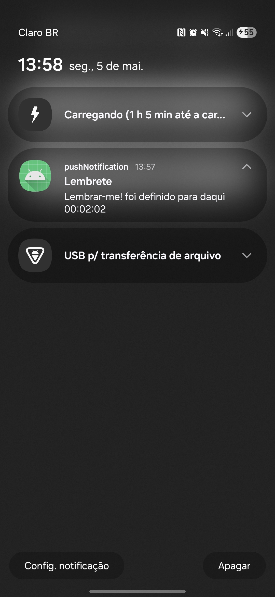
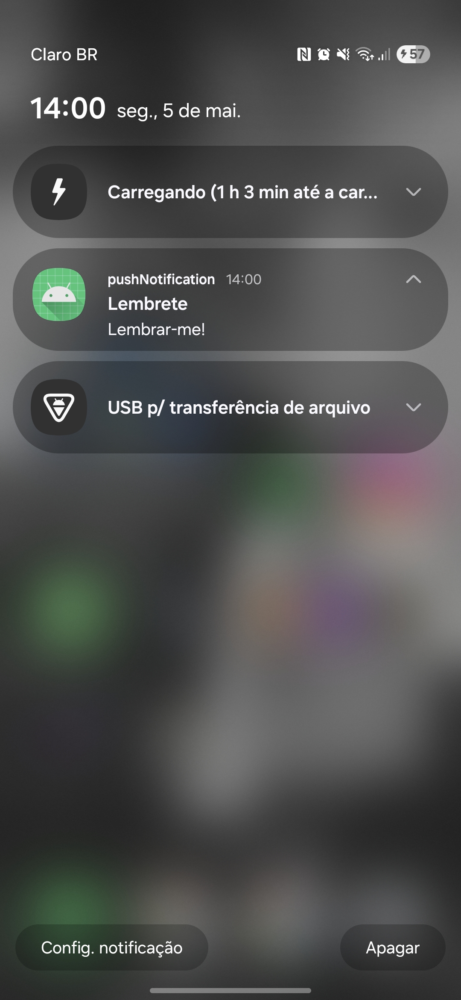
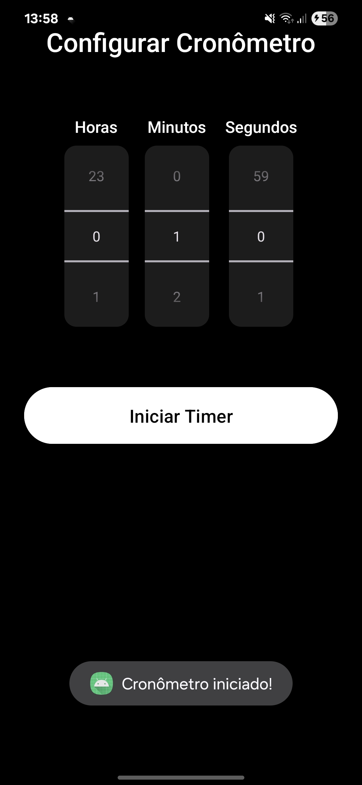
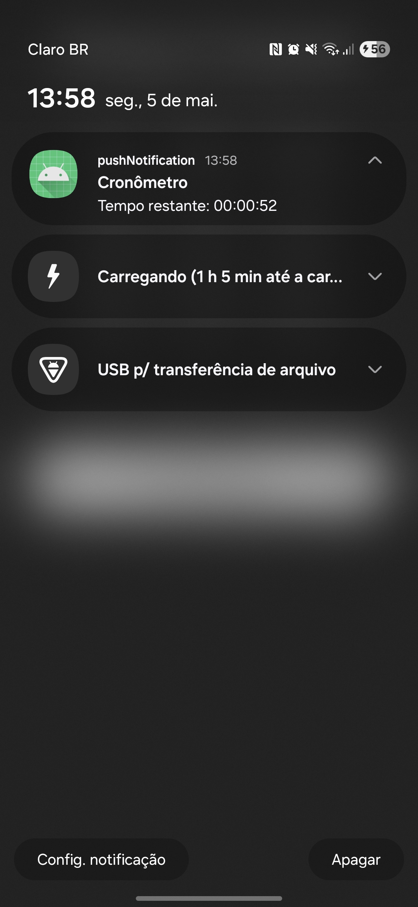
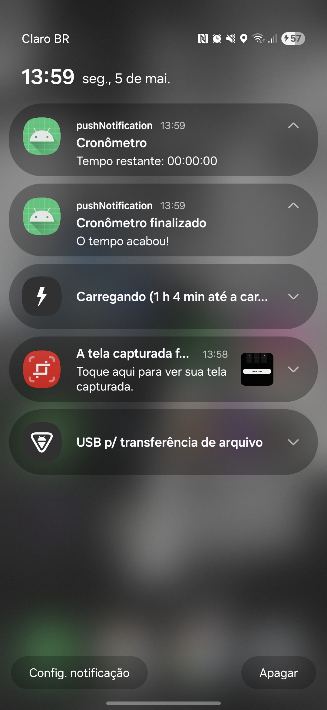

# 📱 pushNotification

Aplicativo Android desenvolvido em Java com funcionalidade de notificações personalizadas.

Projeto da disciplina **Desenvolvimento de Aplicações para Dispositivos Móveis** — UNIVATES, 2025.

---

## ✅ Funcionalidades

- ⏰ Criar lembretes com mensagem e horário definidos
- ⌛ Iniciar contagem de tempo com cronômetro (timer)
- 🔔 Notificações com som, alerta e mensagens customizadas

---

## 🚀 Como Usar

1. Abra o app.
2. Escolha entre definir um **Lembrete** ou iniciar um **Timer**.
3. Escreva uma mensagem personalizada (no caso de lembretes).
4. Selecione o horário ou duração desejada.
5. Aguarde a notificação aparecer na tela.

---

## 🖼️ Prints de Tela

### Tela Principal

### Tela Cronômetro

### Tela Lembrete

### Notificação de Lembrete Agendado

### Notificação de Lembrete Finalizado

### Pop-up Cronômetro Iniciado

### Notificação Cronômetro em Andamento

### Notificação Cronômetro Finalizado

---

## 🛠️ Tecnologias Utilizadas

- Java
- Android Studio
- API de Notificações Android
- TimePicker / AlarmManager

---

## 📚 Créditos

Projeto acadêmico desenvolvido por estudantes da **UNIVATES**, como parte da disciplina de DESENVOLVIMENTO DE APLICAÇÕES PARA DISPOSITIVOS MÓVEIS(2025).
